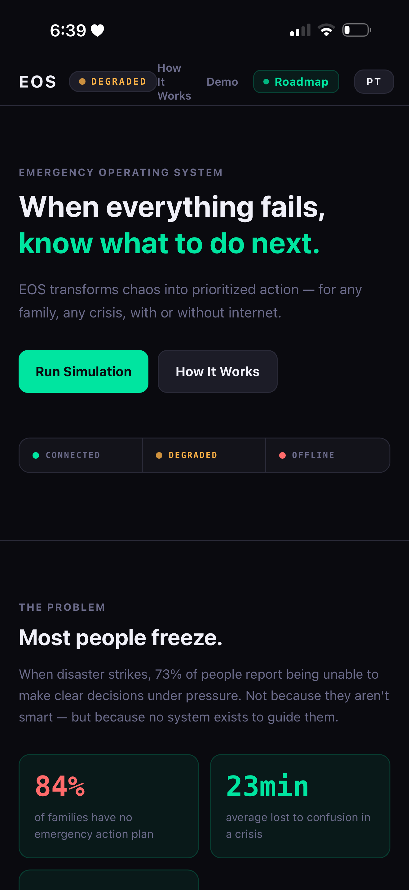
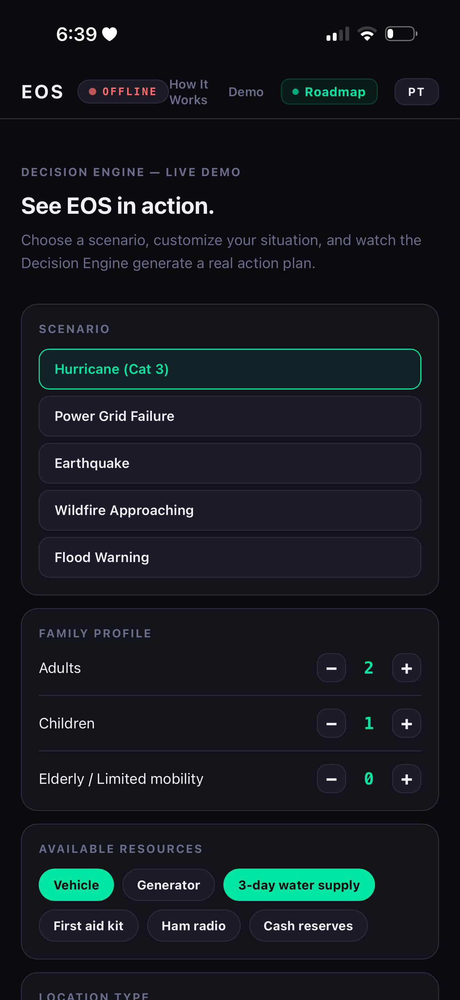
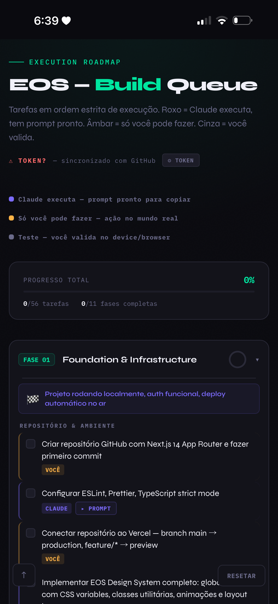

# EOS — Survival Intelligence System

> **When everything fails, know what to do next.**

EOS is a decision-support platform designed to transform uncertainty into prioritized action during emergencies, disasters, infrastructure failures, and high-stress situations.

Unlike traditional emergency tools that focus on information, EOS focuses on decisions.

---

## Product Preview

### Landing Experience



### Decision Engine



### Execution Roadmap



---

## The Problem

Most emergency systems provide information.

During a crisis, information alone is not enough.

People face:

- Cognitive overload
- Conflicting information
- Communication failures
- Infrastructure disruptions
- Time-sensitive decisions

The challenge is not access to information.

The challenge is knowing what to do next.

---

## The Vision

EOS was created around a simple principle:

> Help people make better decisions when conditions are at their worst.

The platform transforms fragmented information into clear, prioritized, and actionable guidance.

---

## From Information to Action

EOS combines:

- Environmental context
- Family composition
- Available resources
- Risk factors
- Emergency protocols
- Offline knowledge systems

And converts them into:

- Immediate actions
- Short-term priorities
- Critical decision points
- Resource gap identification

---

## A Personal McGyver

EOS acts as a digital decision partner.

The goal is not to replace human judgment.

The goal is to improve human judgment under pressure.

Recommendations are generated based on:

- Threat level
- Family profile
- Geographic context
- Resource availability
- Infrastructure status

---

## System Architecture

### Context Engine

Maintains situational awareness through:

- Location context
- Family composition
- Resource inventory
- Risk profile
- Communication capabilities

### Decision Engine

Evaluates:

- Current threat
- Available options
- Resource limitations
- Timing constraints

Produces:

- 15-minute actions
- 1-hour actions
- Critical decision windows

### Resilience Architecture

EOS is designed to operate in three states:

#### Connected

Full access to real-time information sources and external services.

#### Degraded

Limited connectivity with cached knowledge and reduced dependencies.

#### Offline

No internet access.

EOS continues operating through local decision frameworks and offline-first architecture concepts.

---

## Simulation Engine

Future versions of EOS will include:

- Scenario simulations
- Family preparedness training
- Resource gap analysis
- Readiness scoring
- Crisis rehearsal workflows

The objective is to improve decisions before emergencies occur.

---

## Human-Centered Design

EOS is built around one principle:

> Reduce cognitive load during moments of uncertainty.

Every recommendation should be:

- Clear
- Actionable
- Prioritized
- Understandable

---

## Why EOS Matters

EOS represents a shift from:

| Traditional Systems | EOS |
|--------------------|-----|
| Information | Action |
| Data | Decisions |
| Alerts | Guidance |
| Tools | Intelligence |
| Reaction | Preparedness |

---

## Skills Demonstrated

This project showcases experience in:

### AI & Decision Systems

- AI Agent Design
- Prompt Engineering
- Context Management
- Decision Frameworks
- Human-AI Interaction
- Safety-Oriented Design

### Product Design

- Product Strategy
- Systems Thinking
- User Experience Design
- Workflow Architecture

### Operations

- Risk Management
- Emergency Planning
- Resource Allocation
- Process Design

---

## Tech Stack

- **Framework:** Next.js 14 App Router
- **Language:** TypeScript strict mode
- **Database:** Supabase Postgres, Auth, pgvector
- **AI:** OpenAI API
- **Deployment:** Vercel

---

## Future Roadmap

- Personalized family profiles
- Memory architecture
- Simulation engine
- Preparedness scoring
- Mobile platform
- Offline-first capabilities
- Mesh communication integration
- AI-assisted emergency coaching

---

## Getting Started

```bash
npm install
npm run dev
```

---

## Environment Variables

```bash
cp .env.example .env.local
```

Required:

- `NEXT_PUBLIC_SUPABASE_URL`
- `NEXT_PUBLIC_SUPABASE_ANON_KEY`
- `OPENAI_API_KEY`

Optional:

- `OPENAI_MODEL` default: `gpt-5`

---

## Final Statement

> EOS is not just a product.
>
> It is a system designed to guide decisions when nothing else works.
